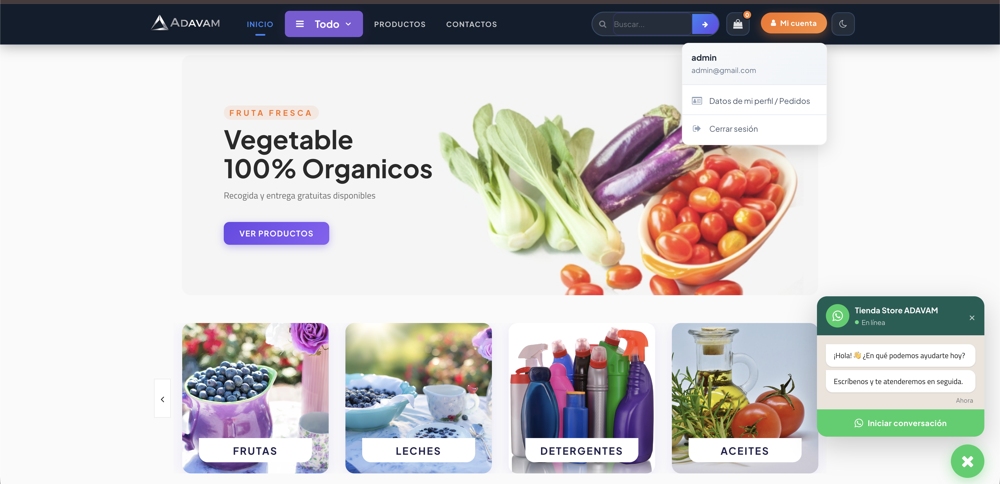
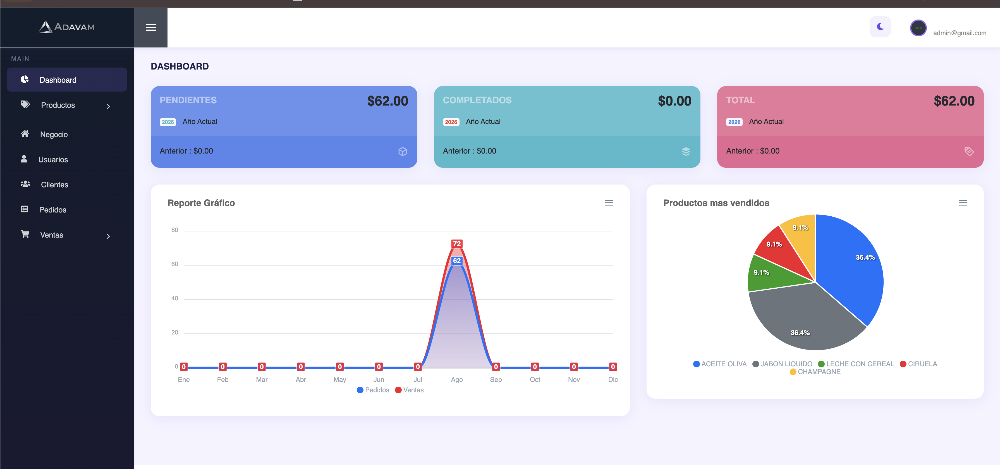

<p align="right">
  <a href="README.md">🇪🇸 Español</a> ·
  <a href="README.en.md">🇬🇧 English</a>
</p>

<p align="center">
  
</p>

<h1 align="center">Store Virtual ADAVAM</h1>

<p align="center">
  A plain-PHP ecommerce store with its own admin panel, built with a hand-rolled MVC architecture (no framework).
</p>

---

## Preview

### Storefront (customer side)


### Admin panel


---

## Admin panel credentials

| Field | Value |
|---|---|
| URL | `http://localhost:8000/admin` |
| Email | `admin@gmail.com` |
| Password | `ADAVAM2026` |

> If these credentials don't work (for example, if someone re-imported the database), you can reset the password directly in the `usuarios` table — see the [Database](#database) section.

---

## Prerequisites

Before configuring the project, make sure you have installed:

| Tool | Minimum version | What it's for |
|---|---|---|
| [PHP](https://www.php.net/) | 7.4 or higher (tested on 8.5) | Runs the whole application |
| PHP extensions | `pdo_mysql`, `mbstring`, `dom`, `gd` | Required by dompdf, PHPMailer and image handling |
| [MySQL](https://www.mysql.com/) or MariaDB | 8.0+ | Database |
| [Composer](https://getcomposer.org/) | 2.x | Installs the PHP dependencies (`dompdf`, `phpmailer`) |

### Install on macOS

The simplest way is with [Homebrew](https://brew.sh/):

```bash
brew install php mysql composer
brew services start mysql
```

### Install on Windows

Two paths, pick one:

**Option A — All-in-one (recommended to get started fast):** install [Laragon](https://laragon.org/) or [XAMPP](https://www.apachefriends.org/), which bundle PHP + MySQL + Apache together, ready to use. With Apache already included you don't need the `router.php` step below: just copy the project into `www/` (Laragon) or `htdocs/` (XAMPP).

**Option B — Install each tool separately:**
1. PHP: download the "Thread Safe" build from [windows.php.net/download](https://windows.php.net/download/) and add its folder to your `PATH`.
2. MySQL: install with the official [MySQL Installer](https://dev.mysql.com/downloads/installer/).
3. Composer: download and run [Composer-Setup.exe](https://getcomposer.org/Composer-Setup.exe) (it auto-detects your PHP install).

Verify everything is on your terminal's `PATH` (PowerShell or CMD):

```powershell
php -v
mysql --version
composer -V
```

---

## Setting it up from scratch (Dev guide)

### 1. Clone the project and install dependencies

```bash
cd store-virtual-with-php
composer install
```

This creates the `vendor/` folder with the `dompdf` (PDF/ticket generation) and `phpmailer` (email sending) libraries.

### 2. Create the database

Create an empty database (pick any name — here we use `store_adavam` as an example) and import the included dump:

```bash
mysql -u root -e "CREATE DATABASE store_adavam CHARACTER SET utf8mb4 COLLATE utf8mb4_general_ci;"
mysql -u root store_adavam < ecommerce.sql
```

This creates the system's 6 tables (see [Database](#database)) with sample data (categories, products, and one admin user).

### 3. Configure the connection

Edit [`Config/Config.php`](Config/Config.php) with your own values:

```php
const BASE_URL = "http://localhost:8000/";   // URL where you'll run the project
const HOST = "localhost";
const USER = "root";                          // your MySQL user
const PASS = "";                              // your MySQL password
const DB = "store_adavam";                    // the name you gave the DB in step 2
const TITLE = "STORE VIRTUAL ADAVAM";
const MONEDA = "USD";
const CLIENT_ID = "";                         // PayPal Client ID (optional, see note below)
```

> **PayPal (optional):** the public checkout has a PayPal button that only works if you fill in `CLIENT_ID`. If you leave it empty, customers can still pay by uploading a bank transfer/deposit receipt (see the `Registro::registrarPedidoManual` flow), which is the method designed for Ecuador/Latin America.

### 4. Start the local server

The project uses `.htaccess` (for Apache) to turn friendly URLs like `principal/productos` into `index.php?url=principal/productos`. If you're using PHP's built-in server instead of Apache, you need a `router.php` that simulates that rewrite, since PHP's built-in server doesn't read `.htaccess`:

```php
<?php
// router.php
$path = parse_url($_SERVER['REQUEST_URI'], PHP_URL_PATH);
$file = __DIR__ . $path;
if ($path !== '/' && file_exists($file) && !is_dir($file)) {
    return false;
}
$_GET['url'] = ltrim($path, '/');
require __DIR__ . '/index.php';
```

Then run, depending on your OS and shell:

**macOS / Linux (bash or zsh):**
```bash
PHP_CLI_SERVER_WORKERS=4 php -S localhost:8000 router.php
```

**Windows (PowerShell):**
```powershell
$env:PHP_CLI_SERVER_WORKERS=4
php -S localhost:8000 router.php
```

**Windows (CMD):**
```cmd
set PHP_CLI_SERVER_WORKERS=4
php -S localhost:8000 router.php
```

> The `PHP_CLI_SERVER_WORKERS=4` flag matters: by default PHP's built-in server handles **one request at a time**, so generating a PDF (a sale ticket) would freeze the whole site for a few seconds for anyone using it. With 4 workers, the server handles several requests in parallel.

If you're using **Apache** instead (Laragon, XAMPP, MAMP, real hosting), you don't need `router.php` or the command above: just drop the project into `htdocs`/`www` and the included `.htaccess` does the work.

### 5. Open the project

- Storefront: `http://localhost:8000/`
- Admin: `http://localhost:8000/admin` (credentials above)

---

## Project structure

This is a **hand-rolled MVC** (no framework): [`index.php`](index.php) is the single entry point, it reads the URL (`controller/method/parameter`), instantiates the matching controller from `Controllers/`, which then calls its model (`Models/`) and renders a view (`Views/`).

```
Config/            → Configuration, DB connection (PDO), autoload, global helpers
Controllers/       → One file per "section" of the system
Models/            → One per controller, with the SQL queries (extends Query/Conexion)
Views/
  ├─ template/      → header.php / footer.php (storefront) and header-admin.php / footer-admin.php (admin)
  ├─ principal/     → public storefront pages
  └─ admin/         → admin panel pages
Librerias/         → Cart.php (session-based shopping cart, third-party library)
public/            → CSS, JS, and images (products, categories, uploaded receipts, logo)
vendor/            → Composer dependencies (dompdf, phpmailer)
```

### Customer side (public storefront)

Main controller: [`Controllers/Principal.php`](Controllers/Principal.php). Views under `Views/principal/`.

| Page | Route | View |
|---|---|---|
| Home | `/` | `Views/index.php` |
| Product listing | `principal/productos` | `productos.php` |
| Category | `principal/categoria/{name}` | `categorias.php` |
| Product detail | `principal/producto/{id}-{slug}` | `producto.php` |
| Cart | `principal/carrito` | `carrito.php` |
| Checkout (address) | `principal/address` | `address.php` |
| Checkout (payment) | `principal/pagos` | `pagos.php` |
| Profile / my orders | `profile` | `profile.php` |

**Login/signup** is a Bootstrap modal that lives in `Views/template/header.php` and opens from any page — it isn't a separate page. It uses `Controllers/Registro.php` (signup and checkout) and `Controllers/Profile.php` (login and account data).

**Checkout flow:** cart → login/signup (modal) → shipping address → payment. Payment supports two paths:
- **PayPal** (requires `CLIENT_ID` to be configured).
- **Manual receipt upload** (bank transfer/deposit image) — designed for Ecuador, via `Controllers/Registro.php::registrarPedidoManual()`. The order stays "pending" until the admin approves it.

### Admin side (admin panel)

All views share `Views/template/header-admin.php` / `footer-admin.php` (sidebar + topbar). One controller per section:

| Section | Controller | What it's for |
|---|---|---|
| Dashboard | `Admin.php` | Admin login and stats (`admin/home`) |
| Categories | `Categorias.php` | Category CRUD |
| Products | `Productos.php` | Product CRUD, images, stock |
| Business | `Negocio.php` | Company data and SMTP settings (for sending emails) |
| Users | `Usuarios.php` | Admin-panel accounts, own profile |
| Customers | `Clientes.php` | Customers registered on the storefront |
| Orders (Pedidos) | `Pedidos.php` | Orders placed from the online store (approve / view receipt) |
| Sales (Ventas) | `Ventas.php` | Point of sale (POS) for in-person sales + history + PDF ticket |

**Orders (Pedidos) vs. Sales (Ventas):** both save rows into the same `ventas` table, but:
- **Orders (Pedidos)** = purchases made by a customer from the online store (`tipo = 1`). The admin reviews and **approves** them (the "Aprobar" button), and can view the payment receipt the customer uploaded.
- **Sales (Ventas)** = sales entered manually by the admin/cashier from the POS (physical counter), which generate a PDF ticket once completed.

---

## Database

6 tables (see [`ecommerce.sql`](ecommerce.sql) for the full schema):

| Table | What it's for | Key relationships |
|---|---|---|
| `categorias` | Product categories | — |
| `productos` | Catalog, price, stock, image | `id_categoria` → `categorias.id` |
| `usuarios` | Customers and admins in a single table | `tipo`: `1` = admin, `2` = customer |
| `ventas` | Header of each sale/order (online and POS) | `id_usuario` → `usuarios.id` |
| `detalle_ventas` | Line items of each sale | `id_venta` → `ventas.id`, `id_producto` → `productos.id` |
| `configuracion` | Company data + SMTP credentials | single row (id=1) |

Important `ventas` columns to understand the order flow:
- `tipo`: `1` = online order, any other value = POS sale.
- `proceso`: `1` = pending approval, `2` = approved/completed.
- `transaccion`: the PayPal transaction id, or the literal text `COMPROBANTE` for a manual payment.
- `comprobante`: filename of the uploaded payment receipt image (stored under `public/img/comprobantes/`).

To manually reset an admin user's password:

```sql
-- generate the hash in PHP: php -r "echo password_hash('your-new-password', PASSWORD_DEFAULT);"
UPDATE usuarios SET clave = '<generated-hash>' WHERE correo = 'admin@gmail.com';
```

---

## Tech stack

- **Backend:** plain PHP (hand-rolled MVC, no framework), PDO for the database.
- **Frontend:** Bootstrap 4 (storefront) and a separate dashboard theme (admin), jQuery, DataTables.
- **PDF:** [dompdf](https://github.com/dompdf/dompdf) for sale tickets.
- **Email:** [PHPMailer](https://github.com/PHPMailer/PHPMailer) for password recovery.
- **Database:** MySQL / MariaDB.
